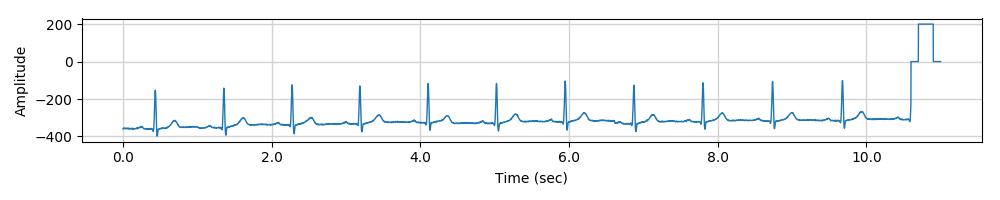
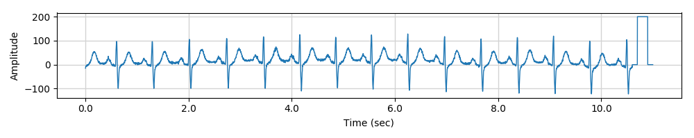
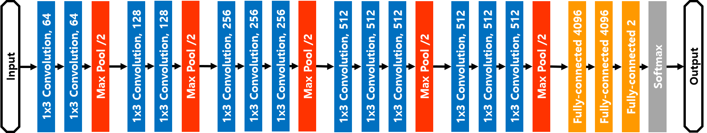
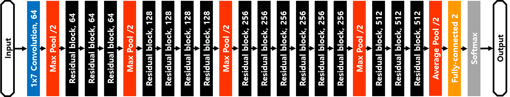

Performance Enhancement Method in CNN-based STEMI Detection in 12-lead Electrocardiogram
=====

## STEMI: ST-elevation myocardial infarction
The complete occlusion of the coronary artery is called STEMI and it is characterized by a sudden shut-down of blood flow caused by thrombus or embolism  

<div align="center">
    
    
  <p>The ECG of normal and STEMI</p>
</div>

## Requirements
* Python 3.5.2  
* Tensorflow 1.4.0  
* Numpy 1.13.3  
* Scipy 1.2.0  
* WFDB 2.2.1  
* Matplotlib 3.0.2  


## Usage
### Preparing the dataset
First, Organize the dataset and keep as below.  
```
Dataset
├── Normal
│   ├── data_1
│   ├── data_2
│   ├── data_3
│   │     ...
│   └── data_n
└── STEMI
```
Then, run the python script as following.  
```
$ python preprocessing.py
$ python preprocessing.py --help // for confirming the option
```

### Training and Test
```
$ cd CNN
$ python run_resnet.py
```
Using `run_vggnet.py` instead of `run_resnet.py` is available for training VGGNet.  

<div align="center">
    
  <p>1D-VGGNet-16</p>  
    
  <p>1D-ResNet-34</p>
</div>
