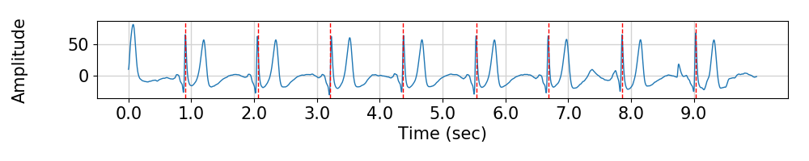
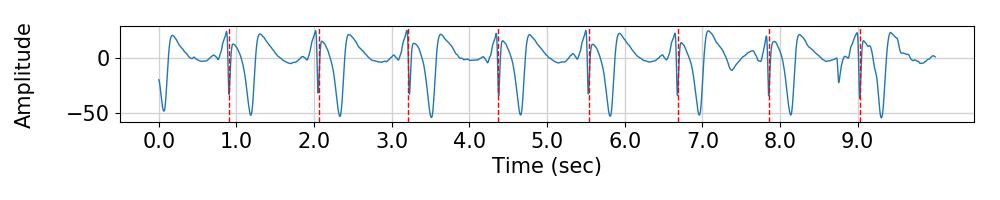
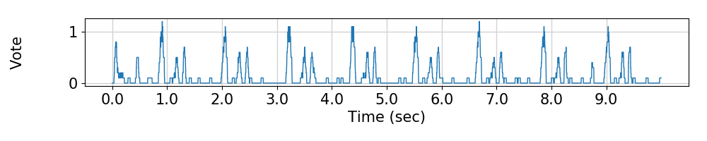

Preprocessing Method for Performance Enhancement in CNN-based STEMI Detection from 12-lead ECG
=====

This repository provides the source code of the paper "Preprocessing Method for Performance Enhancement in CNN-based STEMI Detection from 12-lead ECG".

## STEMI: ST-elevation myocardial infarction
The complete occlusion of the coronary artery is called STEMI and it is characterized by a sudden shut-down of blood flow caused by thrombus or embolism. In the ECG of STEMI, the ST-segment is more elevated than the normal.

<div align="center">
    
    
  <p>The ECG of normal (upper) and STEMI (lower)</p>
</div>

## Requirements
* Python 3.5.2  
* Tensorflow 1.4.0  
* Numpy 1.13.3  
* Scipy 1.2.0  
* WFDB 2.2.1  
* Matplotlib 3.0.2  


## Usage
### Preparing the dataset
First, Organize the dataset and keep as below. Keep the channel (or lead) information in axis 0, and time information in axis 1. For example, 12 lead data with 5500-time length (500Hz x 11 seconds) should be saved as `(12, 5500)` form.  
```
Raw_ECG
├── Normal
│   ├── data_1
│   ├── data_2
│   ├── data_3
│   │     ...
│   └── data_n
└── STEMI
```
Then, run the python script as following.  
```
$ python preprocessing.py
$ python preprocessing.py --help // for confirming the option
```

In the process of executing the above source code, pulse segmentation is performed by voting and choosing the location of the QRS complex as shown below.  

<div align="center">
    
    
    
  <p>The top of the figure shows location voting result for finding the QRS complex. Lower two figure shows most voted time location as QRS complex at lead-I and lead-aVR respectively.</p>
</div>

### Training and Test
```
$ cd CNN
$ python run_resnet.py
```
Using `run_vggnet.py` instead of `run_resnet.py` is available for training VGGNet.  

<div align="center">
    
  <p>1D-VGGNet-16</p>  
    
  <p>1D-ResNet-34</p>
</div>

### Pre-Trained CNN
If you want to use pre-trained model it is available at <a href="https://drive.google.com/drive/folders/1qexMFed1SIO2n1R5EE2QoxCaEA1iiDbf?usp=sharing">Google Drive</a>. Saved parameters are provided for 1D-VGGNet-16 and 1D-ResNet-34 respectively.

Available since Mar.31.2019
